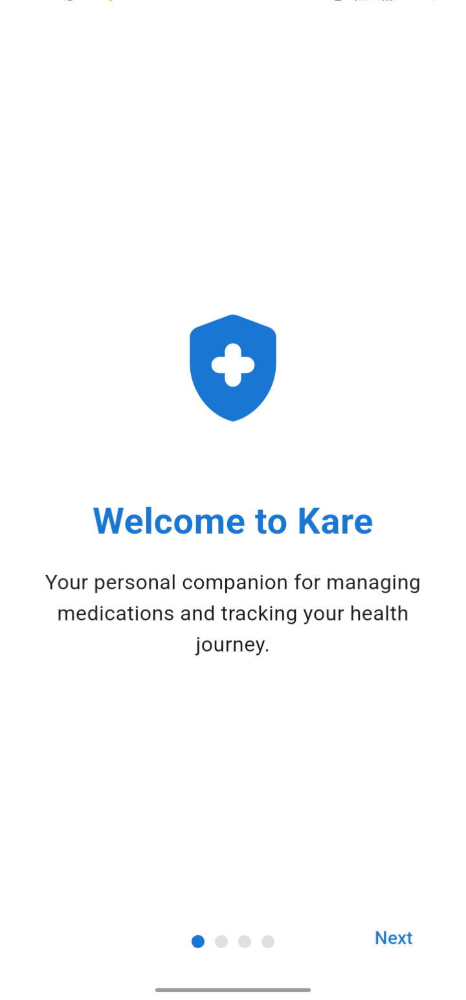
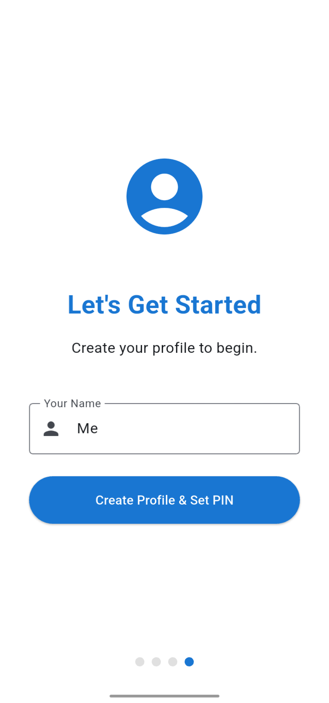
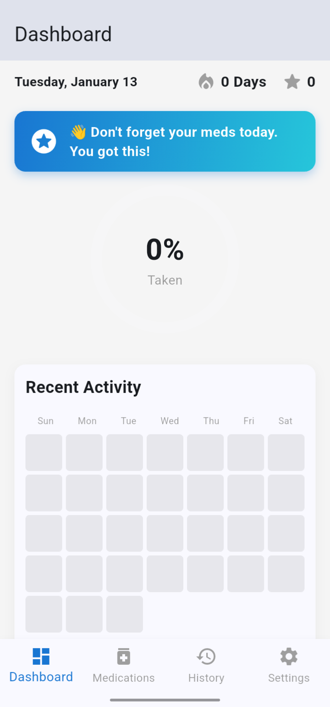
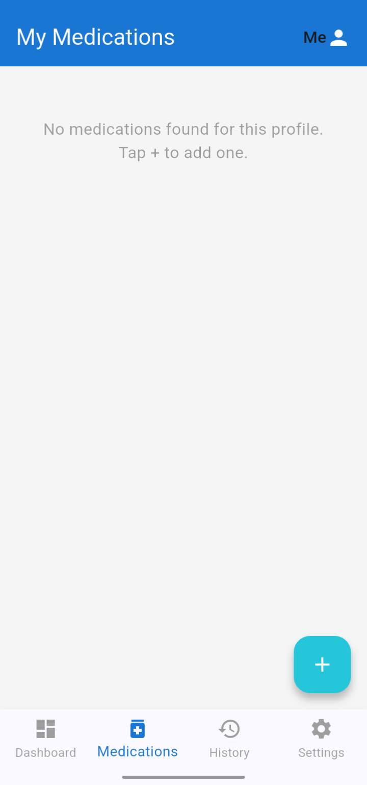
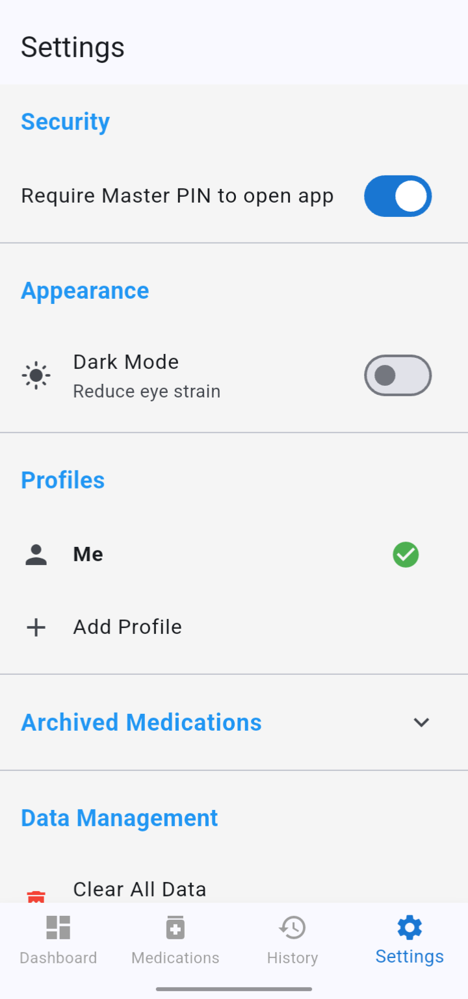

# Kare - Medication Reminder & Adherence Tracker

A simple, yet powerful medication reminder and tracking application built with Flutter. This app helps users manage their medication schedules, track their intake history, and stay on top of their health regimen.

## ✨ Features

- **Flexible Scheduling:** Add medications with multiple daily reminder times, start/end dates, or as ongoing treatments.
- **Customizable Reminders:** Set custom follow-up "nag" reminders to ensure you never miss a dose.
- **Medication Urgency:** Label medications as "Normal," "Medium," or "High" urgency, with corresponding color-coded notifications and UI highlights.
- **Smart Intake Logging:**
    - Log doses with a single tap.
    - Doses are automatically marked as "On-Time" or "Late" based on a dynamic window calculated from your reminder settings.
- **Gamification & Motivation:**
    - Earn points for taking medication: 10 points for on-time doses, 5 for late ones.
    - Maintain a daily adherence streak.
    - Receive motivational messages on your dashboard based on your daily progress.
- **Comprehensive Dashboard:**
    - At-a-glance view of your daily progress, streak, and total points.
    - Lists of "Missed" and "Upcoming" medications for the day.
    - "Recent Activity" heatmap to visualize your adherence over the past month.
    - Alerts for medications running low on stock.
- **Detailed History:** A clear, grouped view of your past intake history.
- **Secure & Private:**
    - All data is stored locally on your device using Hive.
    - Optional 4-digit PIN protection to lock the app.
- **User-Friendly Onboarding:** A smooth, multi-step onboarding flow for new users that explains the app's core features.

## 📸 Screenshots

| Dashboard | Medications List | Add Medication |
| :---: | :---: | :---: |
|  |  |  | width="250"> | width="250"> |

## 🚀 Getting Started

To get a local copy up and running, follow these simple steps.

### Prerequisites

- Flutter SDK: [Installation Guide](https://flutter.dev/docs/get-started/install)
- An editor like VS Code or Android Studio

### Installation

1. Clone the repo
   ```sh
   git clone https://github.com/your_username/kare.git
   ```
2. Navigate to the project directory
   ```sh
   cd kare
   ```
3. Install packages
   ```sh
   flutter pub get
   ```
4. Run the build runner to generate Hive adapters
   ```sh
   dart run build_runner build --delete-conflicting-outputs
   ```
5. Run the app
   ```sh
   flutter run
   ```

## 📖 Project Documentation

For a detailed technical overview of the project, including the architecture, data flow, and database schema, please see the [PROJECT_DOCUMENTATION.md](PROJECT_DOCUMENTATION.md) file.
